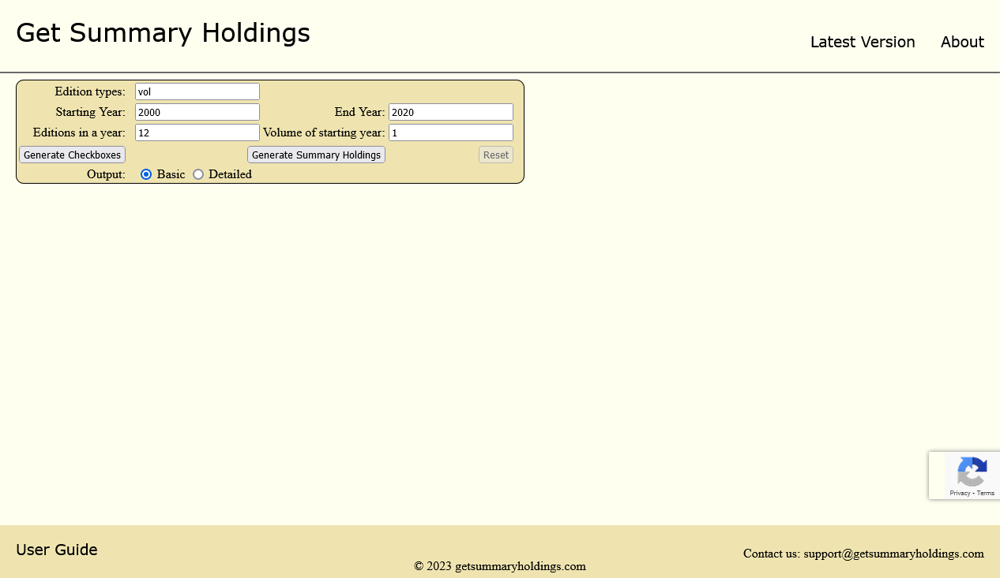

# Get Summary Holdings (GSH)

Production URL: https://getsummaryholdings.com/



### About GSH
* GSH can be called a calculator that allows you to get summary of periodicals in the context of a library.
* GSH helps you to quickly get a summary the available and unavailable periodicals or publications by simply clicking buttons.

## Tech Stack
* Java Spring Boot
* Maven
* JavaScript
* Docker
* HTML
* CSS

## Running the project with:
### Java.
1. Open command prompt in the project directory. 
2. In command prompt building project using the command: `mvn clean install`
3. Once build is successful, go the target folder: `cd target` 
4. Run the project: `java -jar CLRB-Edition_Tracker-1.0-SNAPSHOT.jar`
5. Access project in your browser at the URL: [http://localhost:8080/](http://localhost:8080/)

#### Prerequisites for running with Java:
1. [Java Development Kit (JDK)](https://www.oracle.com/java/technologies/downloads/).
2. [Apache Maven](https://maven.apache.org/download.cgi).

### GitHub Actions (on local)
1. Install act on a Terminal in elevated mode `choco install act-cli`
2. In a Terminal on project root, run `act -s DOCKERHUB_USERNAME=jacobjose123 -s DOCKERHUB_TOKEN=docker_secret_token -s DOCKERHUB_REPOSITORY_NAME=getsummaryholdings`
3. Ensure you **change the Docker** image tags in [docker-publish.yaml](.github/workflows/docker-publish.yaml) before running.
    #### Replace
```
  - name: Build and push Docker image (with release tag from GitHub) to Docker Hub.
    run: |
      docker build -t ${{ secrets.DOCKERHUB_USERNAME }}/${{ secrets.DOCKERHUB_REPOSITORY_NAME }}:${{ github.event.release.tag_name }} .
      docker push ${{ secrets.DOCKERHUB_USERNAME }}/${{ secrets.DOCKERHUB_REPOSITORY_NAME }}:${{ github.event.release.tag_name }}

  - name: Build and push Docker image (with release tag latest) to Docker Hub.
    run: |
      docker build -t ${{ secrets.DOCKERHUB_USERNAME }}/${{ secrets.DOCKERHUB_REPOSITORY_NAME }}:latest .
      docker push ${{ secrets.DOCKERHUB_USERNAME }}/${{ secrets.DOCKERHUB_REPOSITORY_NAME }}:latest
```
#### With
```
  - name: Build and push Docker image (with release tag latest) to Docker Hub.
    run: |
      docker build -t ${{ secrets.DOCKERHUB_USERNAME }}/${{ secrets.DOCKERHUB_REPOSITORY_NAME }}:test .
      docker push ${{ secrets.DOCKERHUB_USERNAME }}/${{ secrets.DOCKERHUB_REPOSITORY_NAME }}:test
```
4. Replace the GitHub action script after test.


### Docker
1. Open command in the project directory.
2. Build the Docker image: `docker build -t clrb-edition-tracker:latest .`
3. Run the Docker image: `docker run -p 8080:8080 clrb-edition-tracker:latest`
4. Access project in your browser at the URL: [http://localhost:8080/](http://localhost:8080/)

#### Prerequisites for running with Docker:
1. [Docker Desktop](https://www.docker.com/products/docker-desktop/)

### Project URLs
* Interactive NextJS UI: https://getsummaryholdings.com/
* Java Spring Boot REST API: https://getsummaryholdings.onrender.com/
* GitHub Static pages Lite UI: [https://jjose14-jacob-jose.github.io/getSummaryHoldings/](https://jjose14-jacob-jose.github.io/getSummaryHoldings/)

### Trivia
Edition Tracker was the original name of the project. It was later renamed to 'Get Summary Holdings'.